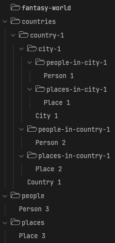

# Fantasy World

This repo is a collection of notes by [Zephyr Snow](https://zephyrsnow.xyz) and [HouseholdDragon](https://github.com/householddragon) about a collaborative fantasy world. It's an [Obsidian](https://obsidian.md) vault.

The countries folder contains a folder for each country. Each of those folders contains an overview file for that country, and folders for cities in that country, people in that country, and places in that country. Each city folder contains an overview file for that city, and folders for people in that city and places in that city.

## Setting Overview

### Races

- Dragons
- Dragonborns
- Kobolds
- Goblins

#### Substitutions

- Wolves (humans)
- Avali (gnomes)
- Wickerbeasts (orcs)
- ??? (dwarves)
- ??? (elves)
- ??? (tieflings)
- Rats (halflings)
- Parrots (kenku)
- Bats (aarakocra)

#### Humblewood Races

- Deer (cervan)
- Crows (corvum)
- Chickens (gallus)
- Hedgehogs (hedge)
- Mice (jerbeen)
- Doves (luma)
- Raccoons (mapach)
- Hawks (raptor)
- Owls (strig)
- Foxes (vulpin)

#### Far Away Sea Races

- Bears
- Goats
- Pigs
- Rabbits
- Otters
- Pandas
